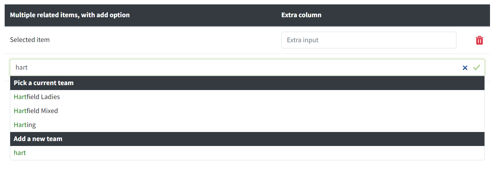
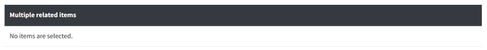

# Select multiple related items

The related item editors let users link items in the database and configure the details of that link. They are designed for use with [Bootstrap 4.6 form styles](https://getbootstrap.com/docs/4.6/components/forms/) and [jQuery Autocomplete](https://github.com/devbridge/jQuery-Autocomplete). See also [Select a related item](RelatedItem.md).

This editor lets a user select zero or more items of the same type using an autocomplete. Use this for items with a one-to-many or many-to-many relationship.



When no item is selected, optionally a message may be shown.



## Example

```html
<table class="table table-hover related-items related-items__create related-items-as-cards related-items-as-cards-reset-md" data-related-item="thing">
    <thead class="thead-dark">
        <tr>
            <th scope="col">Multiple related items, with add option</th>
            <th scope="col">Created here</th>
            <th scope="col" colspan="2"><span class="related-items__if-not-empty">Extra column</span></th>
        </tr>
    </thead>
    <tbody>
        @for (var i = 0; i < Model.Things.Count; i++)
        {
            <tr class="related-item__selected">
                <td class="related-item__selected__section" data-stackable="true">
                    <div class="related-item__animate">
                        <span class="related-items-as-cards__label" aria-hidden="true" data-item="@Model.Things[i].ThingToEditId">
                            Multiple related items, with add option
                        </span>
                        @(Model.Things[i].ThingToEditValue)
                    </div>
                </td>
                <td class="related-item__selected__section" data-stackable="true">
                    <div class="related-item__animate">
                        <span class="related-items-as-cards__label" aria-hidden="true" data-item="@Model.Things[i].ThingToEditId">
                            Created here
                        </span>
                        @(Model.Things[i].CanOnlyBeCreatedHere ? "Yes" : "No")
                    </div>
                </td>
                <td class="related-item__selected__section" data-stackable="true">
                    <div class="related-item__animate">
                        @Html.LabelFor(m => Model.Things[i].ExtraProperty, 
                            new 
                            { 
                                @class = "related-items-as-cards__label", 
                                aria_hidden = "true", 
                                data_item = Model.Things[i].ThingToEditId 
                            }
                        )
                        @Html.TextBoxFor(m => Model.Things[i].ExtraProperty, 
                            new 
                            { 
                                @class = "form-control related-item__data", 
                                data_item = Model.Things[i].ThingToEditId 
                            }
                        )
                    </div>
                </td>
                <td class="related-item__delete related-item__selected__section">
                    <div class="related-item__animate">
                        @Html.Hidden($"Things[{i}].ThingToEditId", Model.Things[i].ThingToEditId, 
                            new 
                            { 
                                @class = "related-item__data related-item__id", 
                                data_item = Model.Things[i].ThingToEditId 
                            }
                        )
                        @Html.Hidden($"Things[{i}].ThingToEditValue", Model.Things[i].ThingToEditValue, 
                            new 
                            {
                                @class = "related-item__data", 
                                data_item = Model.Things[i].ThingToEditId 
                            }
                        )
                        <button class="btn-delete-icon" type="button">
                            @await Html.PartialAsync("_DeleteIcon", "Remove thing from this thing")
                        </button>
                    </div>
                </td>
            </tr>
        }
        <tr>
            <td colspan="3">
                @Html.Label("thing-autocomplete", "Add a thing", new { @class = "sr-only" })
                @Html.TextBox("thing-autocomplete", string.Empty, 
                    new
                    {
                        @class = "form-control related-item__search",
                        placeholder = "Add a thing",
                        autocomplete = "off",
                        type = "search",
                        data_url = "/api/things/autocomplete",
                        data_template = "thing-template",
                        // data_value_template = "{{data.thingToEditValue}} ({{data.thingToEditDetail}})",
                        // data_suggestion_template = "{{data.thingToEditValue}} ({{data.thingToEditDetail}})",
                        aria_label = "Type a thing and press down arrow to select the thing"
                    }
                )
            </td>
        </tr>
    </tbody>
    <tbody>
        <tr class="related-items__if-empty"><td colspan="3">No things have been selected.</td></tr>
    </tbody>
</table>
<template id="thing-template">
    <table>
        <tr class="related-item__selected">
            <td class="related-item__selected__section">
                <div class="related-item__animate">
                    <span class="related-items-as-cards__label" aria-hidden="true" data-item="{{data}}">
                        Multiple related items, with add option
                    </span>
                    {{value}}
                </div>
            </td>
            <td class="related-item__selected__section">
                <div class="related-item__animate">
                    <span class="related-items-as-cards__label" aria-hidden="true" data-item="{{data}}">
                        Created here
                    </span>
                    {{create}}
                </div>
            </td>
            <td class="related-item__selected__section">
                <div class="related-item__animate">
                    <span class="related-items-as-cards__label" aria-hidden="true" data-item="{{data}}">
                        Extra column
                    </span>
                    Extra column data
                </div>
            </td>
            <td class="related-item__delete related-item__selected__section">
                <div class="related-item__animate">
                    <input name="Things[0].ThingToEditId" 
                           class="related-item__data related-item__id" 
                           type="hidden" 
                           value="{{data}}"
                           data-item="{{data}}" />
                    <input name="Things[0].ThingToEditValue" 
                           class="related-item__data" 
                           type="hidden" 
                           value="{{value}}" 
                           data-item="{{data}}" />
                    <button class="btn-delete-icon" type="button">
                        @await Html.PartialAsync("_DeleteIcon", "Remove {{value}}")
                    </button>
                </div>
            </td>
        </tr>
    </table>
</template>
```

## HTML structure

Class | Role
----- | ----
`.related-items` | Identifies a `table` element as the root of a related item editor. Must apply `.table` and `.table-hover` on the same element. Must contain a child `thead` element with `.thead-dark` applied. Optionally set attribute `data-related-item` on the `table` element to a plain English singular description of the type of thing being managed.
`.related-item__selected` | Identifies a `tr` as a container for a selected item, or an item pre-selected on page load. Must have a child `.related-item__selected__section`.
`.related-item__selected__section` | Identifies a `td` as a container for a field, a value or a button within a selected item. Must be a child of a `.related-item__selected`. Must have a child `.related-item__animate`.
`.related-item__animate`| Must be a child of a `.related-item__selected__section`. Supports the animation of a `.related-item__selected` as it is deleted.
`.related-item__delete` | A `.related-item__selected__section` containing a delete button. Must apply `.related-item__selected__section` on the same element. Must contain a `<button type="button" />`.
`.related-item__selected--deleting`| Applied automatically on a `.related-item__selected` when it is deleted, for the duration of the animation.
`.related-items__create` | Optional. Applied on the `table` element. Indicates support for adding a new items as well as selecting an existing one. The autocomplete results list is separated into two groups for 'Pick a current thing' and 'Add a new thing'.
`.related-items__empty` | Applied automatically on the `.related-items` table when the last item is removed. Your code should add this class if there are no items on initial load.
`.related-items__if-empty`<br />`.related-items__if-not-empty` | Optional. Shows an element only when no items / at least one item is selected. Typically used to hide `th` elements (or `span` elements within `th`) and show a `tr` with a 'No items are selected.' message.
`.related-item__data` | Any field (visible or hidden) containing data about the selected item. If the field is visible, you must apply `.form-control` on the same element. Must set attribute `data-item` to an identifier for the item using `{{data}}` or `{{id}}`.
`.related-item__id` | Hidden field containing the id of the selected item. Must apply `.related-item__data` on the same element.
`.related-item__search` | Search field in the last row of the table. Must be a child of a `td`, typically with a `colspan` attribute set to span the whole table row. Must apply `form-control` on the same element.
`.related-items-as-cards` | Optional. Applied on the `table` element. Indicates that on small screens the display will change from a table to a card layout. A `data-stackable="true"` attribute must be applied on any `.related-item__selected__section` which is to be displayed on the card layout, except where `.related-item__delete` is already applied. Bootstrap utility classes `.d-*` can also be used to show or hide elements at different breakpoints.
`.related-items-as-cards-reset-md` | Optional. Required when `.related-items-as-cards` is used. Applied on the `table` element. Enables a switch from card view to table view at medium breakpoint.
`.related-items-as-cards__label`| Optional. Required when `.related-items-as-cards` is used. On small screens the `thead` element is hidden. This identifies an alternative label added for the card view. Must be a child of `.related-item__animate`. Must set attribute `aria-hidden="true"`. Must set attribute `data-item` to an identifier for the item using `{{data}}` or `{{id}}`.

## Attributes of `.related-item-search`

Attribute | Role
--------- | ----
`autocomplete` | Must be set to `off` to prevent browser autocomplete options competing with jQuery Autocomplete options.
`type` | Must be set to `search` to correctly identify the role of the field for accessibility.
`data-url` | URL for JSON autocomplete suggestions matching the search term. The JSON format is shown below. The search term is added to the value of `data-url` as a `query` parameter on the querystring.
`data-template` | The `id` of any inert HTML element containing the template for displaying a selected item. The template can include tokens. When an item is selected from the JSON autocomplete suggestions, these tokens are replaced by the values from the selected item.
`data-value-template` | Optional. A custom string used as a template for the text shown for a single item in the list of autocomplete suggestions. The template can include tokens. The default template is `{{value}}`.
`data-suggestion-template` | Optional. A custom string used as a template for the text shown in the search field as the focus moves through the list of autocomplete suggestions. The template can include tokens. The default template is `{{value}}`.

## Tokens

These tokens are valid:

- inside the template element identified by the `data-template` attribute
- in the value of the `data-value-template` attribute
- in the value of the `data-suggestion-template` attribute

Token | Role
----- | ----
`{{value}}` | The value of the `value` property of the selected item.
`{{data}}`| An identifier for an existing item. The value of the `data.data` property if `data` is an object, or the value of the `data` property if it is a string.
`{{data.otherProperty}}` | The value of the `data.otherProperty` property where `data` is an object and `otherProperty` is any property of that object.
`{{id}}`| A generated identifier for a new item to be created.
`{{create}}`| 'Yes' if a new item is being created due to the use of `.related-items__create`. 'No' if an existing item is being selected when `.related-items__create` is applied. Empty string if `.related-items__create` is not applied.

## JSON format for autocomplete suggestions

```json
{ 
    "suggestions": [
        {
            "data": "identifier of item 1",
            "value": "display name of item 1"
        },
        {
            "data": "identifier of item 2",
            "value": "display name of item 2"
        }
    ] 
}
```

or

```json
{ 
    "suggestions": [
        {
            "data": {
                "data": "identifier of item 1",
                "otherProperty": "another property of item 1"
            },
            "value": "display name of item 1"
        },
        {
            "data": {
                "data": "identifier of item 2",
                "otherProperty": "another property of item 2"
            },
            "value": "display name of item 2"
        }
    ] 
}
```

## Extensibility

The related items editor is highly customisable. A `.relatedItems` property is added on the `.related-items` table which provides access to some of the internal methods used by the editor.

For example, see `edit-tournament-matches.js` where support is added for:

- custom fields in place of `.related-item__search`
- custom validation
- adding new items using an 'add another' button in place of `.related-items__create`
- sorting items using drag and drop or the keyboard
