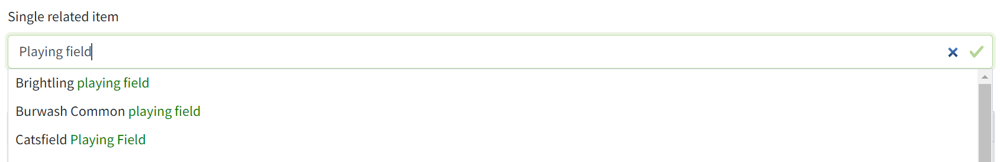
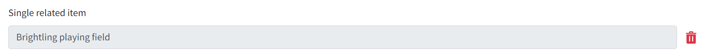

# Select a related item

The related item editors let users link items in the database and configure the details of that link. They are designed for use with [Bootstrap 4.6 form styles](https://getbootstrap.com/docs/4.6/components/forms/) and [jQuery Autocomplete](https://github.com/devbridge/jQuery-Autocomplete). See also [Select multiple related items](RelatedItems.md).

This editor lets a user select a single item of a specific type using an autocomplete. Use this for items with a many-to-one relationship.



When the item is selected, it is not editable and a delete button allows the user to reset the editor.



## Example

```razor
<div class="form-group related-item">
  @Html.LabelFor(m => Model.ThingToEditValue, RequiredFieldStatus.Optional, new { @class = "has-form-text" })
  <p class="form-text" id="thing-to-edit-hint">
    <small>Hint text about the thing to edit.</small>
  </p>
  @if (Model.ThingToEditId.HasValue) 
  {
    <div class="related-item__selected--only-item">
        <div class="related-item__selected__section">
        @Html.TextBoxFor(m => Model.ThingToEditValue, 
            new { 
                @class = "form-control", 
                @readonly = "readonly", 
                aria_describedby = "thing-to-edit-hint thing-to-edit-error" 
            }
        )
        </div>
        <div class="related-item__delete related-item__selected__section">
        @Html.HiddenFor(m => Model.ThingToEditId, new { @class = "related-item__data related-item__id" })
        <button class="btn-delete-icon" type="button">
            @await Html.PartialAsync("_DeleteIcon", $"Remove {Model.ThingToEditValue} from this thing")
        </button>
        </div>
    </div>
    Model.ThingToEditValue = string.Empty; 
    @Html.TextBoxFor(m => Model.ThingToEditValue, 
          new 
          {
              @class = "form-control related-item__search", 
              placeholder = "Type the thing", 
              autocomplete = "off", 
              type = "search",
              data_url = $"/api/things/autocomplete", 
              data_template = "thing-to-edit-template", 
              aria_label = "Type a thing and press down arrow to select from the matching choices", 
              disabled = "disabled" 
          }
      ) 
  } 
  else 
  {
    @Html.TextBoxFor(m => Model.ThingToEditValue, 
          new 
          { 
              @class = "form-control related-item__search", 
              placeholder = "Type the thing", 
              autocomplete = "off", 
              type = "search", 
              data_url = $"/api/things/autocomplete", 
              data_template = "thing-to-edit-template", 
              aria_label = "Type a thing and press down arrow to select from the matching choices" 
          }
      ) 
  } 
  @Html.ValidationMessageFor(m => Model.ThingToEditId, null, new { id = "thing-to-edit-error" })
</div>
<template id="thing-to-edit-template">
  <div class="related-item__selected--only-item">
      <div class="related-item__selected__section">
          <input type="text" 
                 readonly="readonly" 
                 value="{{value}}" 
                 class="form-control" 
                 id="ThingToEditValue" 
                 name="ThingToEditValue" 
                 aria-describedby="thing-to-edit-hint thing-to-edit-error" />
      </div>
      <div class="related-item__delete related-item__selected__section">
          <input name="ThingToEditId" 
                 class="related-item__data related-item__id" 
                 type="hidden" 
                 value="{{data}}" />
          <button class="btn-delete-icon" type="button">
            @await Html.PartialAsync("_DeleteIcon", "Remove {{value}} from this thing")
          </button>
      </div>
  </div>
</template>
```

## HTML structure

Class | Role
----- | ----
`.related-item`                         | Identifies an element as the root of a related item editor. Must apply `.form-group` on the same element.
`.related-item__selected--only-item`    | Container for a selected item, or an item pre-selected on page load. Must be a child of `.related-item`. Must have a child `.related-item__selected__section`.
`.related-item__selected__section`      | Container for a field, a value or a button within a selected item. Must be a child of `.related-item__selected--only-item`.
`.related-item__delete`                 | A `.related-item__selected__section` containing a delete button. Must apply `.related-item__selected__section` on the same element. Must contain a `<button type="button" />`.
`.related-item__data`                   | Any field (visible or hidden) containing data about the selected item. If the field is visible, you must apply `.form-control` on the same element.
`.related-item__id`                     | Hidden field containing the id of the selected item. Must apply `.related-item__data` to the same element.
`.related-item__search`                 | Search field shown when no item is selected. Must be a child of `.related-item`. Must apply `form-control` on the same element.

## Attributes of `.related-item-search`

Attribute | Role
--------- | ----
`autocomplete` | Must be set to `off` to prevent browser autocomplete options competing with jQuery Autocomplete options.
`type` | Must be set to `search` to correctly identify the role of the field for accessibility.
`data-url` | URL for JSON autocomplete suggestions matching the search term. The JSON format is shown below. The search term is added to the value of `data-url` as a `query` parameter on the querystring.
`data-template` | The `id` of any inert HTML element containing the template for displaying a selected item. The template can include `{{data}}` and `{{value}}` tokens. When an item is selected from the JSON autocomplete suggestions, these tokens are replaced by the values of the `data` and `value` properties of the selected item.
`disabled` | Required if an item is pre-selected on page load. The search field must be rendered as `disabled` in this case, so that it may be shown if the selected item is deselected.

## JSON format for autocomplete suggestions

```json
{ 
    "suggestions": [
        {
            "data": "identifier of item 1",
            "value": "display name of item 1"
        },
        {
            "data": "identifier of item 2",
            "value": "display name of item 2"
        }
    ] 
}
```
